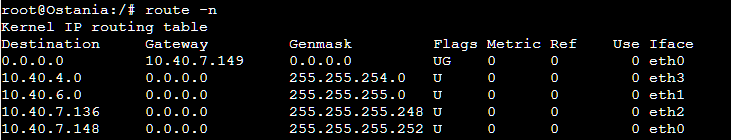
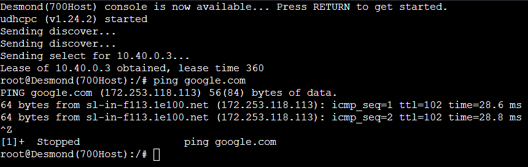
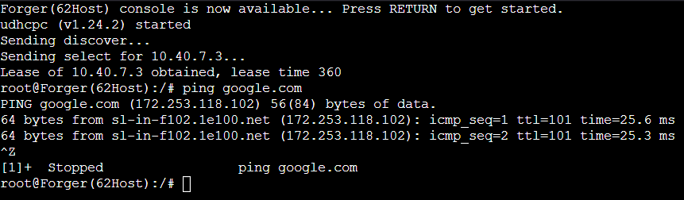
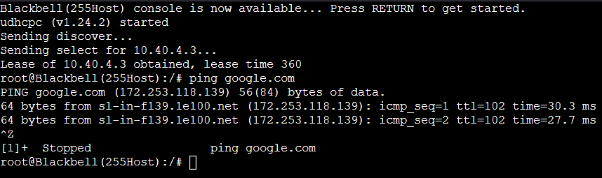
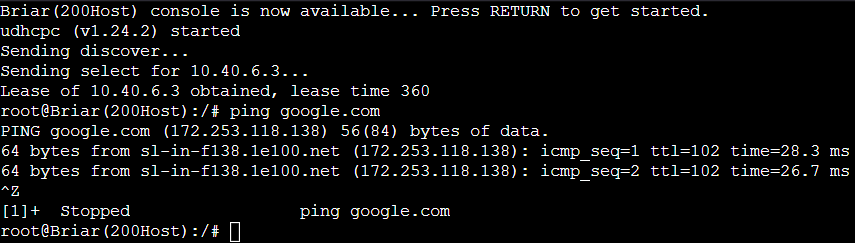
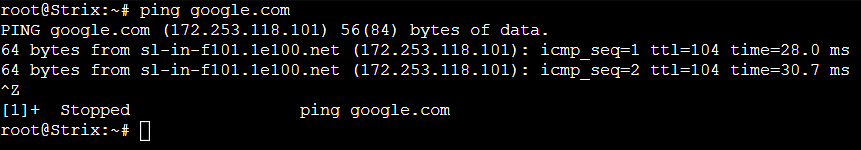

# Jarkom-Modul-5-ITA01-2022

Repository Laporan Resmi Praktikum Jaringan Komputer Modul 5 Kelompok ITA01 Tahun 2022.

1. Damarhafni Rahmannabel Nadim P (5027201026)
2. Salman Al Farisi Sudirlan (5027201056)
3. I Putu Windy Arya Sagita (5027201071)

Kontribusi untuk modul ini sama rata (33.33% per orang).

# Daftar Isi

- [Daftar Isi](https://github.com/windyarya/Jarkom-Modul-5-ITA01-2022#daftar-isi)
- [Konfigurasi](https://github.com/windyarya/Jarkom-Modul-5-ITA01-2022#konfigurasi)
	- [Konfigurasi A](https://github.com/windyarya/Jarkom-Modul-5-ITA01-2022#konfigurasi-a)
	- [Konfigurasi B](https://github.com/windyarya/Jarkom-Modul-5-ITA01-2022#konfigurasi-b)
	- [Konfigurasi C](https://github.com/windyarya/Jarkom-Modul-5-ITA01-2022#konfigurasi-c)
	- [Konfigurasi d](https://github.com/windyarya/Jarkom-Modul-5-ITA01-2022#konfigurasi-d)
- [Soal](https://github.com/windyarya/Jarkom-Modul-5-ITA01-2022#soal)
	- [Soal 1](https://github.com/windyarya/Jarkom-Modul-5-ITA01-2022#soal-1)
- [Kendala](https://github.com/windyarya/Jarkom-Modul-5-ITA01-2022#kendala)

# Konfigurasi

## Konfigurasi A

### Gambar Topologi


## Kofigurasi B

### Metode Subnetting VLSM
Untuk mengerjakan dengan metode VLSM, kami membagi gambar tersebut kedalam beberapa bagian kecil. Berikut adalah gambar pembagian yang telah kami buat.  


Setelah kami melakukan pembagian tersebut, berikut nya kami menghitung berapa jumlah host pada setiap subnet dan netmask berapa yang akan digunakan. Berikut adalah perhitungan yang kami gunakan

| Label | Jumlah Host | Alokasi | Address     | Netmask | Dec Mask        | Range                   | Broadcast   |
|-------|-------------|---------|-------------|---------|-----------------|-------------------------|-------------|
| A2    |         701 |    1022 | 10.40.0.0   | /22     | 255.255.252.0   | 10.40.0.1-10.40.3.254   | 10.40.3.255 |
| A7    |         256 |     510 | 10.40.4.0   | /23     | 255.255.254.0   | 10.40.4.1-10.40.5.254   | 10.40.5.255 |
| A6    |         201 |     254 | 10.40.6.0   | /24     | 255.255.255.0   | 10.40.6.1-10.40.6.254   | 10.40.6.255 |
| A3    |          63 |     126 | 10.40.7.0   | /25     | 255.255.255.128 | 10.40.7.1-10.40.7.126   | 10.40.7.127 |
| A1    |           3 |       6 | 10.40.7.128 | /29     | 255.255.255.248 | 10.40.7.129-10.40.7.134 | 10.40.7.135 |
| A8    |           3 |       6 | 10.40.7.136 | /29     | 255.255.255.248 | 10.40.7.137-10.40.7.142 | 10.40.7.143 |
| A4    |           2 |       2 | 10.40.7.144 | /30     | 255.255.255.252 | 10.40.7.145-10.40.7.146 | 10.40.7.147 |
| A5    |           2 |       2 | 10.40.7.148 | /30     | 255.255.255.252 | 10.40.7.149-10.40.7.150 | 10.40.7.151 |
| Total |        1231 |         |             | /21     |                 |                         |             |

## Konfigurasi C

### Konfigurasi IP

- Konfigurasi IP pada router Strix

```bash
auto eth0
iface eth0 inet dhcp

auto eth1
iface eth1 inet static
	address 10.40.7.145
	netmask 255.255.255.252

auto eth2
iface eth2 inet static
	address 10.40.7.149
	netmask 255.255.255.252
```

- Konfigurasi IP pada router Westalis

```bash
auto eth0
iface eth0 inet static
	address 10.40.7.146
	netmask 255.255.255.252
	gateway 10.40.7.145

auto eth1
iface eth1 inet static
	address 10.40.7.1
	netmask 255.255.255.128

auto eth2
iface eth2 inet static
	address 10.40.7.129
	netmask 255.255.255.248

auto eth3
iface eth3 inet static
	address 10.40.0.1
	netmask 255.255.252.0
```

- Konfigurasi IP pada router Ostania

```bash
auto eth0
iface eth0 inet static
	address 10.40.7.150
	netmask 255.255.255.252
	gateway 10.40.7.149

auto eth1
iface eth1 inet static
	address 10.40.6.1
	netmask 255.255.255.0

auto eth2
iface eth2 inet static
	address 10.40.7.137
	netmask 255.255.255.248

auto eth3
iface eth3 inet static
	address 10.40.4.1
	netmask 255.255.254.0
```

- Konfigurasi IP Eden

```bash
auto eth0
iface eth0 inet static
	address 10.40.7.130
	netmask 255.255.255.248
	gateway 10.40.7.129
```
- Konfigurasi IP WISE

```bash
auto eth0
iface eth0 inet static
	address 10.40.7.131
	netmask 255.255.255.0
	gateway 10.40.7.129
```

- Konfigurasi IP SSS

```bash
auto eth0
iface eth0 inet static
	address 10.40.7.139
	netmask 255.255.255.248
	gateway 10.40.7.137
```

- Konfigurasi IP SSS

```bash
auto eth0
iface eth0 inet static
	address 10.40.7.138
	netmask 255.255.255.248
	gateway 10.40.7.137
```

### Konfigurasi Routing

Pada hal ini kami diminta untuk melakukan Routing agar setiap perangkat pada jaringan tersebut terhubung.<br>


1. Routing pada `router westalis`.<br>


2. Routing pada `ostania`.<br>


## Konfigurasi D

### Instruksi

Tugas berikutnya adalah memberikan ip pada subnet Forger, Desmond, Blackbell, dan Briar secara dinamis menggunakan bantuan DHCP server. Kemudian kalian ingat bahwa kalian harus setting DHCP Relay pada router yang menghubungkannya.

### Penyelesaian

Pertama-tama lakukan instalasi dan set up DHCP Relay pada dua router yang menghubungkan subnet-subnet, yaitu Westalis dan Ostania. Instalasi DHCP Relay dapat dilakukan dengan command berikut.

```bash
apt-get install isc-dhcp-relay -y
```

Kemudian, lakukan setting DHCP Relay pada file `/etc/default/isc-dhcp-relay` dengan mengarahkan ke DHCP Server (WISE) dan interface yang digunakan, lengkapnya dapat dilihat di bawah ini.

```bash
SERVERS="10.40.7.131"
INTERFACES="eth0 eth1 eth2 eth3"
OPTIONS=""
```

Kemudian, lakukan restart DHCP Relay dengan command berikut

```bash
service isc-dhcp-relay restart
```

Setelah melakukan set up DHCP Relay, kemudian kami melakukan set up DHCP Server pada WISE. Seperti biasa langkah pertama adalah melakukan instalasi dari DHCP Server dengan command berikut.

```bash
apt-get install isc-dhcp-server -y
```

Kemudian, masukan interface dari WISE yang terhubung dengan jaringan, yaitu `eth0` ke dalam file config `/etc/default/isc-dhcp-server` seperti berikut.

```bash
INTERFACES=\"eth0\"
```

Setelah itu, lakukan konfigurasi dengan memasukan semua subnet yang ada pada jaringan ke dalam `/etc/dhcp/dhcpd.conf` seperti berikut.

```bash
ddns-update-style none;
option domain-name \"example.org\";
option domain-name-servers ns1.example.org, ns2.example.org;
default-lease-time 600;
max-lease-time 7200;
log-facility local7;

#Subnet A2
subnet 10.40.0.0 netmask 255.255.252.0 {
        range 10.40.0.2 10.40.3.254;
        option routers 10.40.0.1;
        option broadcast-address 10.40.3.255;
        option domain-name-servers 10.40.7.130;
        default-lease-time 360;
        max-lease-time 7200;
}

#Subnet A7
subnet 10.40.4.0 netmask 255.255.254.0 {
        range 10.40.4.2 10.40.5.254;
        option routers 10.40.4.1;
        option broadcast-address 10.40.5.255;
        option domain-name-servers 10.40.7.130;
        default-lease-time 360;
        max-lease-time 7200;
}

#Subnet A6
subnet 10.40.6.0 netmask 255.255.255.0 {
        range 10.40.6.2 10.40.6.254;
        option routers 10.40.6.1;
        option broadcast-address 10.40.6.255;
        option domain-name-servers 10.40.7.130;
        default-lease-time 360;
        max-lease-time 7200;
}

#Subnet A3
subnet 10.40.7.0 netmask 255.255.255.128 {
        range 10.40.7.2 10.40.7.126;
        option routers 10.40.7.1;
        option broadcast-address 10.40.7.127;
        option domain-name-servers 10.40.7.130;
        default-lease-time 360;
        max-lease-time 7200;
}

#Subnet A1
subnet 10.40.7.128 netmask 255.255.255.248 {}

#Subnet A8
subnet 10.40.7.136 netmask 255.255.255.248 {}

#Subnet A4
subnet 10.40.7.144 netmask 255.255.255.252 {}

#Subnet A5
subnet 10.40.7.148 netmask 255.255.255.252 {}
```

Setelah mengatur config tersebut, restart DHCP Server dengan command berikut.

```bash
service isc-dhcp-server restart
```

Setelah melakukan konfigurasi DHCP Server, maka kami selanjutnya melakukan konfigurasi DNS Server pada Eden. Pertama-tama untuk melakukan konfigurasi DNS Server, kami menginstall `bind9` terlebih dahulu dengan command berikut.

```bash
apt-get install bind9 -y
```

Kemudian, lakukan konfigurasi DNS Server pada file `/etc/bind/named.conf.options` dan mengarahkan forwarders ke nameserver yang didapatkan dari Strix seperti berikut ini.

```bash
options {
        directory \"/var/cache/bind\";
        forwarders {
                192.168.122.1;
        };
        allow-query{ any; };
        auth-nxdomain no;
        listen-on-v6 { any; };
```

Kemudian, lakukan restart bind9 agar konfigurasi tersebut dapat teraplikasi dengan command berikut.

```bash
service bind9 restart
```

### Testing

Kami melakukan testing ping pada semua client yang ada.









# Soal

## Soal 1

### Soal 1

Agar topologi yang kalian buat dapat mengakses keluar, kalian diminta untuk mengkonfigurasi Strix menggunakan iptables, tetapi Loid tidak ingin menggunakan MASQUERADE.

### Penyelesaian

Untuk melakukan ini, kami mengganti command MASQUERADE yang diberikan di awal modul GNS3 menjadi sebagai berikut.

```bash
ipEth0="$(ip -br a | grep eth0 | awk '{print $NF}' | cut -d'/' -f1)"
iptables -t nat -A POSTROUTING -s 10.40.0.0/21 -o eth0 -j SNAT --to-source "$ipEth0"
```

### Testing

Kami melakukan testing ping pada Strix.



## Kendala

Kami masih kesulitan dalam melakukan konfigurasi dari soal-soal selanjutnya karena masih mempelajari dan belum begitu paham dengan Firewall pada GNS3.

Terima kasih :v: