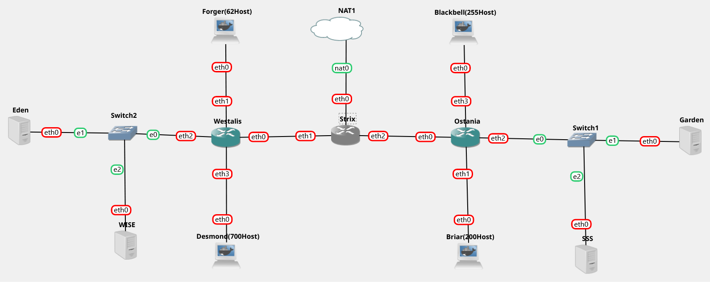
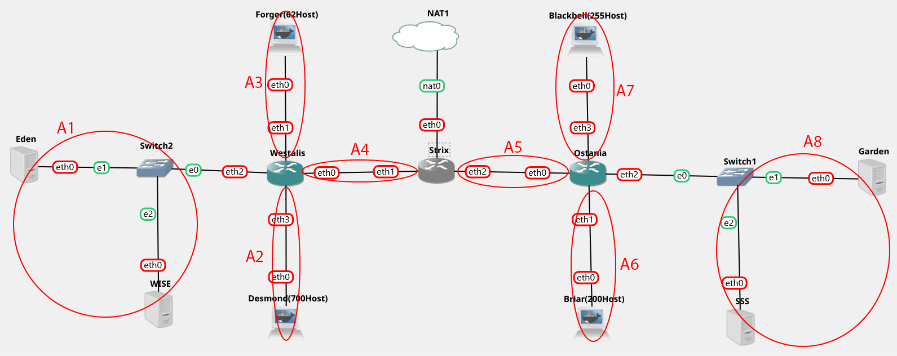
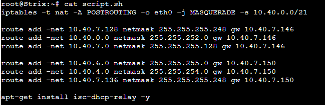
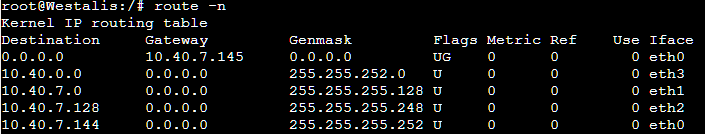

# Jarkom-Modul-5-ITA01-2022

Repository Laporan Resmi Praktikum Jaringan Komputer Modul 5 Kelompok ITA01 Tahun 2022.

1. Damarhafni Rahmannabel Nadim P (5027201026)
2. Salman Al Farisi Sudirlan (5027201056)
3. I Putu Windy Arya Sagita (5027201071)

Kontribusi untuk modul ini sama rata (33.33% per orang).

### Gambar Topologi

### Metode Subnetting VLSM
Untuk mengerjakan dengan metode VLSM, kami membagi gambar tersebut kedalam beberapa bagian kecil. Berikut adalah gambar pembagian yang telah kami buat.  

Setelah kami melakukan pembagian tersebut, berikut nya kami menghitung berapa jumlah host pada setiap subnet dan netmask berapa yang akan digunakan. Berikut adalah perhitungan yang kami gunakan

| Label | Jumlah Host | Alokasi | Address     | Netmask | Dec Mask        | Range                   | Broadcast   |
|-------|-------------|---------|-------------|---------|-----------------|-------------------------|-------------|
| A2    |         701 |    1022 | 10.40.0.0   | /22     | 255.255.252.0   | 10.40.0.1-10.40.3.254   | 10.40.3.255 |
| A7    |         256 |     510 | 10.40.4.0   | /23     | 255.255.254.0   | 10.40.4.1-10.40.5.254   | 10.40.5.255 |
| A6    |         201 |     254 | 10.40.6.0   | /24     | 255.255.255.0   | 10.40.6.1-10.40.6.254   | 10.40.6.255 |
| A3    |          63 |     126 | 10.40.7.0   | /25     | 255.255.255.128 | 10.40.7.1-10.40.7.126   | 10.40.7.127 |
| A1    |           3 |       6 | 10.40.7.128 | /29     | 255.255.255.248 | 10.40.7.129-10.40.7.134 | 10.40.7.135 |
| A8    |           3 |       6 | 10.40.7.136 | /29     | 255.255.255.248 | 10.40.7.137-10.40.7.142 | 10.40.7.143 |
| A4    |           2 |       2 | 10.40.7.144 | /30     | 255.255.255.252 | 10.40.7.145-10.40.7.146 | 10.40.7.147 |
| A5    |           2 |       2 | 10.40.7.148 | /30     | 255.255.255.252 | 10.40.7.149-10.40.7.150 | 10.40.7.151 |
| Total |        1231 |         |             | /21     |                 |                         |             |

### Melakukan konfigurasi
pada hal ini kami diminta untuk melakukan Routing agar setiap perangkat pada jaringan tersebut terhubung. 

1. Routing pada `router westalis`. 

